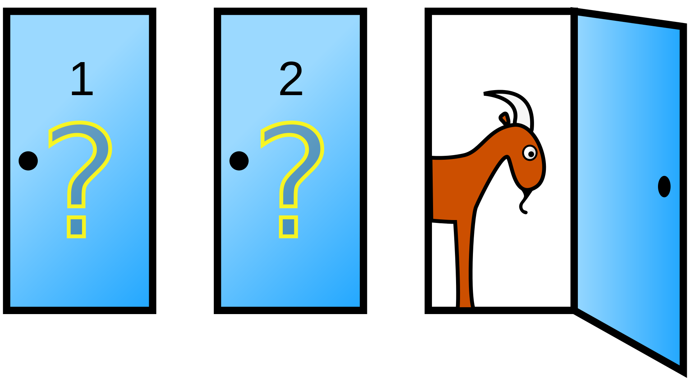
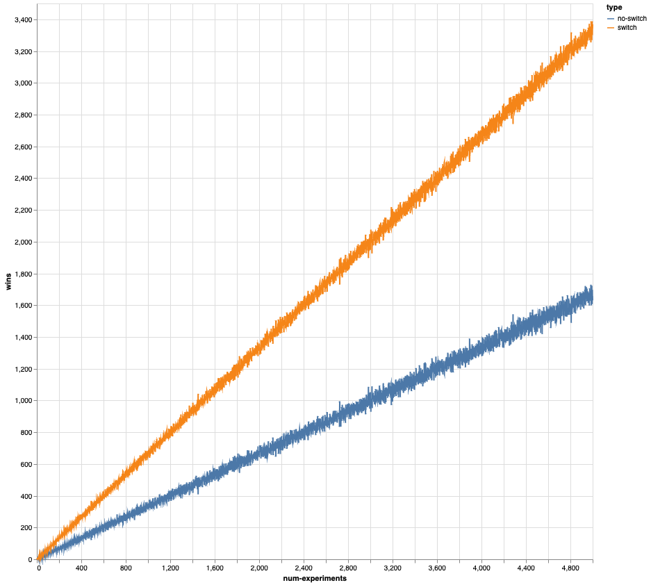

# monty

A Clojure library that runs multiple simulations of the [Monty Hall
problem](https://en.wikipedia.org/wiki/Monty_Hall_problem) using the [Monte Carlo
method](https://en.wikipedia.org/wiki/Monte_Carlo_method).

## The Monty Hall Problem

Suppose you're on a game show, and you're given the choice of three doors: Behind one door
is a car; behind the others, goats. You pick a door, say No. 1, and the host, who knows
what's behind the doors, opens another door, say No. 3, which has a goat. He then says to
you, "Do you want to pick door No. 2?" Is it to your advantage to switch your choice?

In search of a new car, the player picks a door, say 1. The game host then opens one of
the other doors, say 3, to reveal a goat and offers to let the player switch from door 1
to door 2.




## Usage

```bash
lein run
```

## Result



## License

Copyright © 2022 FIXME

This program and the accompanying materials are made available under the
terms of the Eclipse Public License 2.0 which is available at
http://www.eclipse.org/legal/epl-2.0.

This Source Code may also be made available under the following Secondary
Licenses when the conditions for such availability set forth in the Eclipse
Public License, v. 2.0 are satisfied: GNU General Public License as published by
the Free Software Foundation, either version 2 of the License, or (at your
option) any later version, with the GNU Classpath Exception which is available
at https://www.gnu.org/software/classpath/license.html.
